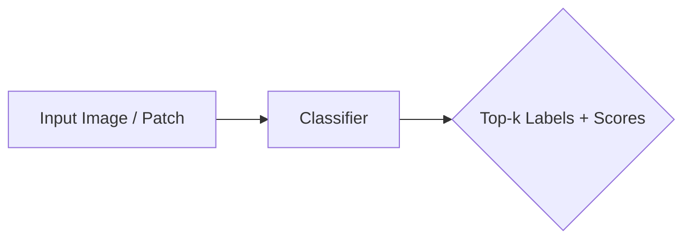
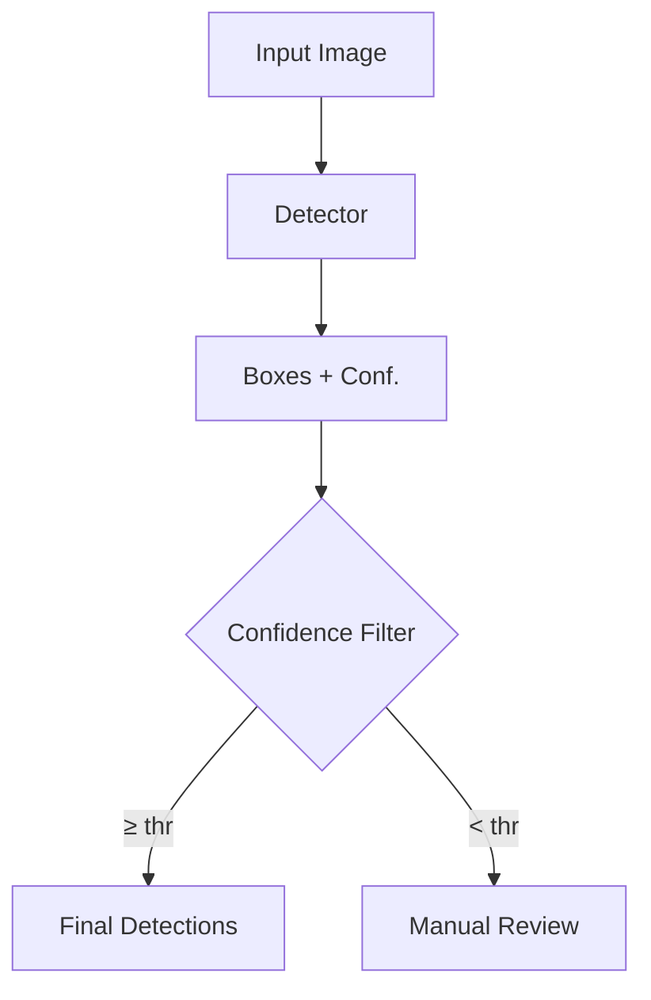
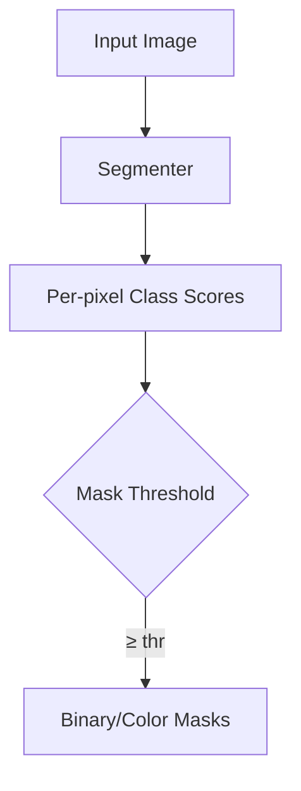

# Model Card – One‑Page Quick Guide (General Template)

> **Purpose:**  
> Give users a consistent, one‑glance explainer for **any** AI model you publish(classifier, detector, segmenter, & etc).  Swap the placeholders (🔷) for your model‑specific details.  The sample snippets refer to a **object detector** only as an example.

---

## 0. Model‑at‑a‑Glance Diagram
Pick the sketch that fits your task (or embed your own).  

### 🔹 Classification

### 🔹 Object Detection (example)

### 🔹 Segmentation

> **Task:** 🔷 `<classification / detection / segmentation>`  
> **Classes:** 🔷 `<list or count>`

---

## 1. Model Card Anatomy (60‑Second Walk‑Through)
| 🔍 Section | What it tells you | Questions it answers |
|-----------|------------------|----------------------|
| **Model Details** | Architecture, input size, training schedule | “Does it fit my stack?” |
| **Intended Use & Limitations** | What it’s for / not for | “Will it work on my data?” |
| **Dataset & Pre‑processing** | Source, splits, augmentations | “Is training data representative?” |
| **Performance** | Main metrics + curves | “How many FP/FN?” |
| **Ethical & Environmental Risks** | Failure modes, bias notes | “Any red flags?” |
| **Usage Examples** | Code, CLI, thresholds | “How do I run it?” |

---

## 2. Metrics Cheat‑Sheet (per task)
| Task | Key Metrics | FP/FN intuition |
|------|-------------|-----------------|
| **Classification** | Accuracy, Precision/Recall, F1, ROC‑AUC | FP = wrong label; FN = missed class |
| **Detection** | mAP@IoU, Precision, Recall, F1 | FP = extra box; FN = missed object |
| **Segmentation** | IoU / mIoU, Dice / F1, Precision, Recall | FP = extra pixels; FN = missed pixels |

> **Example snippet**: “At 0.25 confidence the detector scores **mAP50 0.81**, **Precision 0.78**, **Recall 0.84** (≈ 22 FP & 16 FN per 100 predictions).”

---

## 3. Choosing Thresholds
| Task | Typical thresholds | When to go **lower** | When to go **higher** |
|------|--------------------|----------------------|-----------------------|
| Classification | Logit > 0.5 (binary) / top‑k | Capture rare positives | Avoid false alarms |
| Detection | `--conf` 0.2‑0.4 + IoU 0.5 | Human‑in‑the‑loop review | Automated alerts |
| Segmentation | Mask prob 0.5 | Over‑segment to review | Precise boundaries |

Always validate on a slice of **your** data—lighting, turbidity, or domain shift moves the sweet spot.

---

## 4. Standard FP/FN Reporting Template
1. **Dataset snapshot & DOI / commit hash**  
2. **Confusion matrix or counts table** (per class)  
3. **Curves** – ROC / PR / mAP with chosen threshold marked  
4. **Example gallery** – top‑n FP & FN  
5. **Version tag** – e.g. `v2.1.0`, HF commit, Docker hash

---

## 5. Training Facts (fill in)
| Item | Value |
|------|-------|
| **Model** | 🔷 `<name / checkpoint>` |
| **Data** | 🔷 `<dataset name + size>` |
| **Classes** | 🔷 `<n>` |
| **Augmentations** | 🔷 `<list>` |
| **Epochs / Batch** | 🔷 `<values>` |
| **Best metric** | 🔷 `<mAP / mIoU / F1>` |

---

## 6. When *Not* to Trust This Model
List your top‑3 failure modes.  Examples:
* Low‑light or turbidity > 2 m (underwater)  
* Camera tilt > 45°  
* Classes unseen in training set

---

## 7. Maintenance & Versioning
* **Semantic versioning** – bump **MAJOR** if dataset or task changes.  
* Publish model card + changelog for every release.  
* Archive weights & data for reproducibility.

---

### 📌 Copy‑Paste Summary (template)
> *“Using `<task‑specific threshold>`, **<MODEL_NAME>** scores **<metric>** on the hold‑out set.  Lowering threshold to `<x>` increases recall to `<y>` at the cost of precision.  See model card for full FP/FN analysis.”*

---

### Example Box (Object Detector)
> *YOLO v11 Fish Detector – Grayscale* achieves **mAP50 0.81** with **Precision 0.78**, **Recall 0.84** at `--conf 0.25`.  Raise to `0.5` for ~90 % precision.  Model card: <https://huggingface.co/akridge/yolo11-fish-detector-grayscale>.

---

Need adjustments? Ping 🔷 `<contact>`.  Happy detecting / classifying / segmenting!
