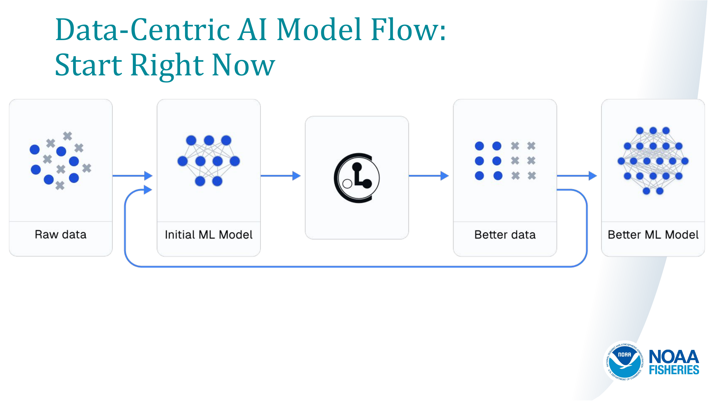
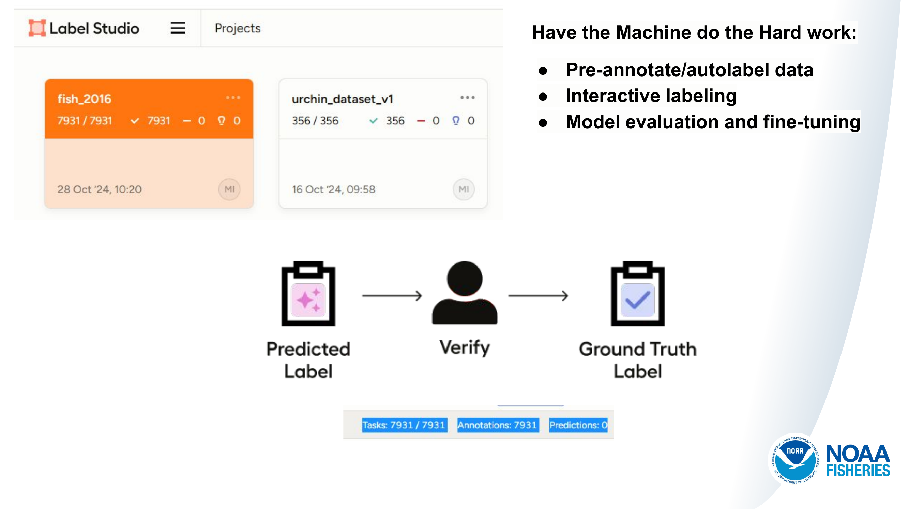
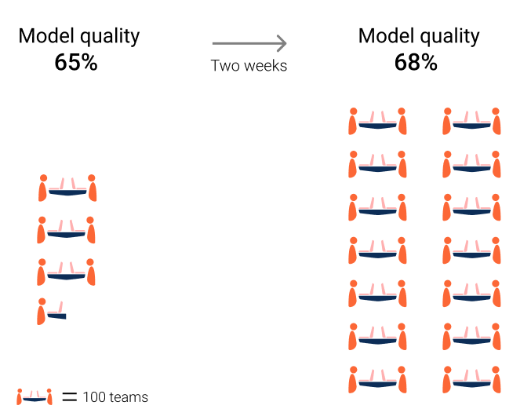

# AI/ML Model Lifecycle

### 0. Simple Lifecycle

###  1. AI/ML is Non-Linear
#### Performance of the model and its output is not proportional to the input. Not just data input, but effort as well.

- Figure: "illustrates the uncertainty in ML development by showing the significant increase in effort but only minimal gains in model quality."[Source: Google Kaggle(AI//ML & ML competition platform) Case Study](https://developers.google.com/machine-learning/managing-ml-projects/planning)

### 2. Experimentation is key. 
- try different architectures  
- try and tune [hyperparameters](https://docs.ultralytics.com/guides/hyperparameter-tuning/)
- test different training techniques like data augmentation or different optimizers