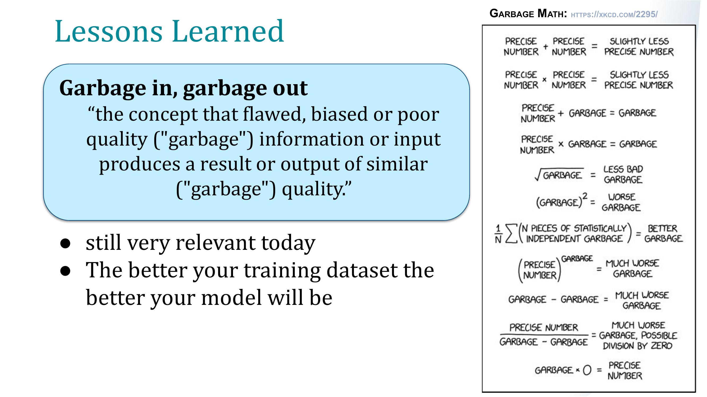

# Role of Annotations in Model Performance
Data annotation is the process of labeling data to make it usable for training machine learning models.

### Annotations are the **foundation** of model performance. 
- They provide the **ground truth** that a model learns from.
- Machine learning depends heavily on **data quality**
- **High-quality, well labeled annotations = Better model generalization & accuracy.**

### Machine Learning = 80% Data Management + 20% Model Building

> **“In machine learning, 80% of your time is spent preparing and cleaning the data, and only 20% of the time is spent on actual model building.”**  
> — *Andrew Ng, former Stanford AI Director/Professor*
- Annotations fall into the **80% of the effort** spent on data prep and cleaning.

## TLDR: Garbage in, garbage out

- Poor or inconsistent annotations can lead to poor performance, while high-quality annotations can significantly improve accuracy. 
