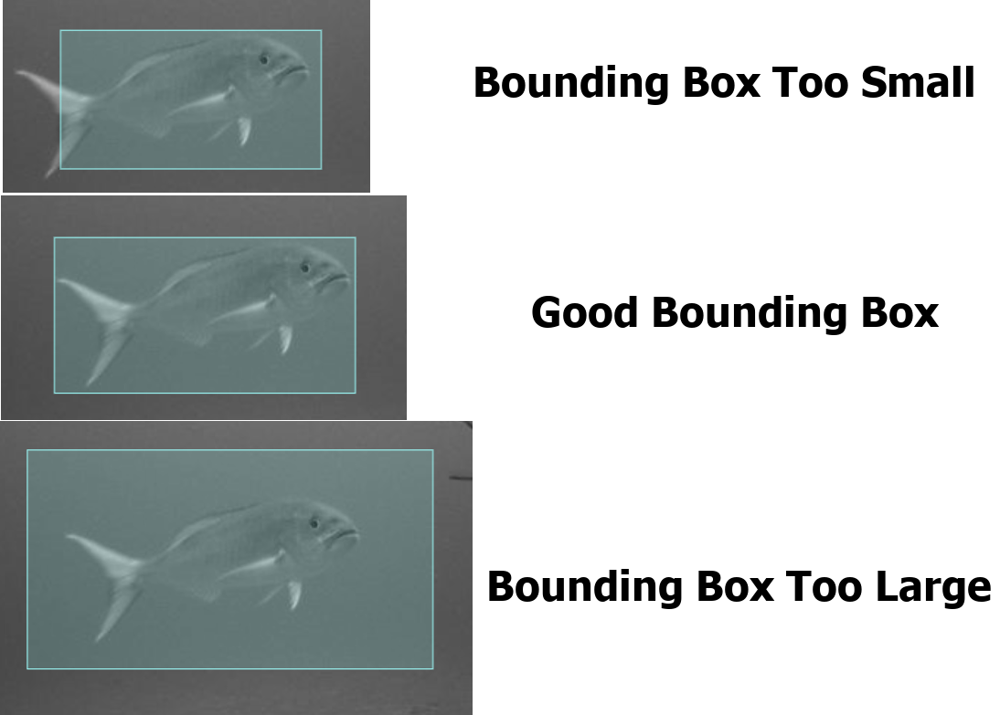
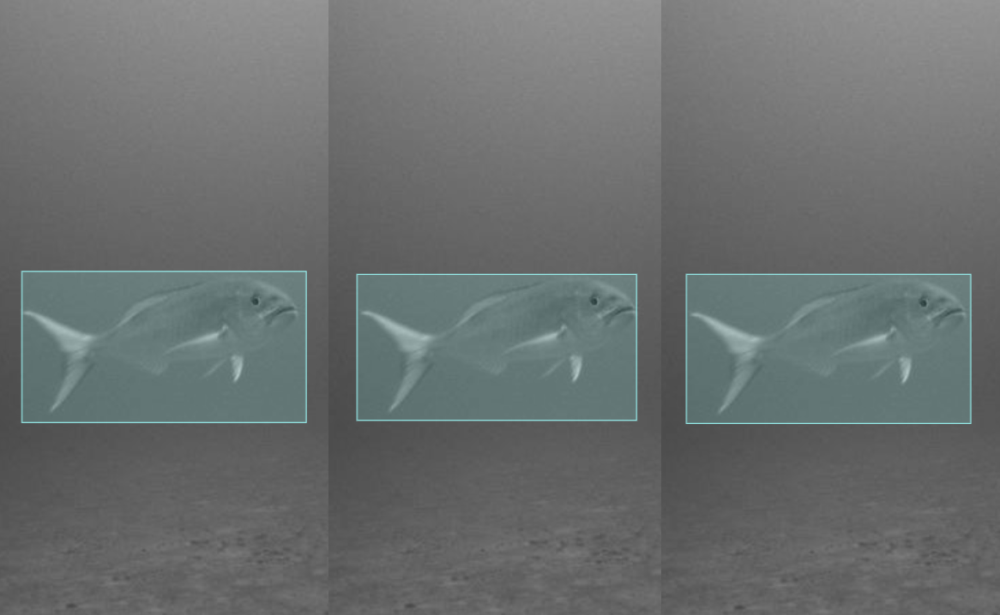
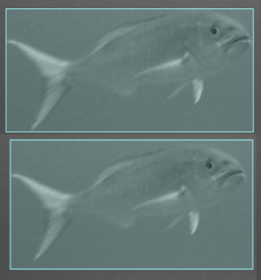

# Annotation Best Practices

- Label consistency. 
    - All instances of all classes in all images must be labelled. 
    - Partial labelling will impact performance.
- Label accuracy. 
    - Ensure tight and consistent bounding boxes.
    - Labels must closely enclose each object. 
    - No space should exist between an object, and it's bounding box. 
    - No objects should be missing a label.

# Precision & Accuracy 
- **Precision** indicates the consistency of annotations
- **Accuracy** refers to how close the annotated data is to the true values
## Example: Initially looks the same

## Zoom to see the difference in Accuracy

> High accuracy and precision lead to better-trained models by reducing noise

## What about Partially Visible (Occluded) Objects (like urchins)?
- Two main approaches. No right or wrong answer. 
- **Experimentation** and then **consistency** is key. 

1. **Estimate and draw full bounding boxes** (for full object learning)
    - pro: helpful for other downstream opencv tasks like segmenation and sizing techniques
    - con: subjective and time consuming. 
    - **Suggestion:** If full object learning is important, try instance segmentation instead
2. Or **Draw Bounding box only around the visible portion** (recommeneded)
    - pro: grounded in what is actually visable
    - cons: inconsistent box sizes. postential for more false postives/negatives
    - **Important Dataset Note:** 
        - For this techinque, ensure a good balance of fully visible and partially occluded objects in final training dataset

### Example Annotation Flow for Occluded Objects: 
- Fully visible:  
    - Draw a tight bounding box around the entire object.
- Partially Visable: 
    - Draw a box around just the exposed portion
- Mostly covered: 
    - If confident annotate it. 
    - But if unsure, just skip it.