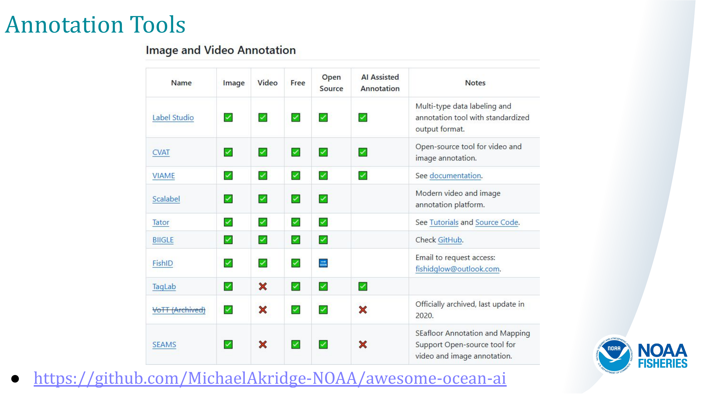

# Annotation Tools
- https://github.com/MichaelAkridge-NOAA/awesome-ocean-ai

# Tips and Tricks | When Picking a Tool: 
- Look at Features
- Ease of Use 
- Ease of Installation
- Ease of getting your annotations out in a common format
- Look for Open source 
- Look to see if the Tool is supported/still being developed
- Look at the Users/Community
- Look for Documentation

## Lots of Image and Video Annotation Tools Out There
| Name | Image | Video | Free | Open Source | AI Assisted Annotation | Notes |
|---------------------------------------------------|-------|-------|------|-------------|------------------------|-----------------------------------------------------------------------------------------------|
| [Label Studio](https://github.com/HumanSignal/label-studio) | ✅ | ✅ | ✅ | ✅ | ✅ | Multi-type data labeling and annotation tool with standardized output format. |
| [CVAT](https://github.com/opencv/cvat) | ✅ | ✅ | ✅ | ✅ | ✅ | Open-source tool for video and image annotation. |
| [VIAME](http://www.viametoolkit.org/) | ✅ | ✅ | ✅ | ✅ | ✅ | See [documentation](https://viame.readthedocs.io/en/latest/section_links/documentation_overview.html). |
| [Tator](https://www.tator.io/) | ✅ | ✅ | ✅ | ✅ |  | See [Tutorials](https://www.tator.io/tutorials) and [Source Code](https://github.com/cvisionai/Tator). |
| [TagLab](https://github.com/cnr-isti-vclab/TagLab/) | ✅ | ❌ | ✅ | ✅ | ✅ |  |

## And more! - https://github.com/MichaelAkridge-NOAA/awesome-ocean-ai
