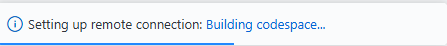
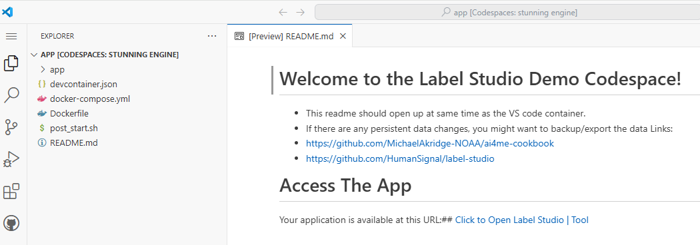
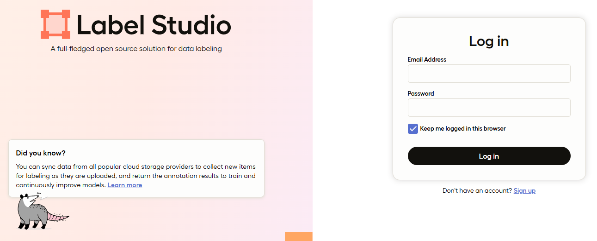

# 🛠️ Exercise - Annotation
```{sidebar} Install Label Studio Locally
- [Label Studio Github](https://github.com/HumanSignal/label-studio)
pip install label-studio
```
### Label Studio Annotation Demo 
[](https://codespaces.new/MichaelAkridge-NOAA/ai4me-cookbook?devcontainer_path=.devcontainer%2Flabel-studio-demo%2Fdevcontainer.json)

### Once in Codespace, wait or click bottom right to view build progress

### A readme should open up once ready

### Click link and it will open the Label Studio App


- Click signup and create a login