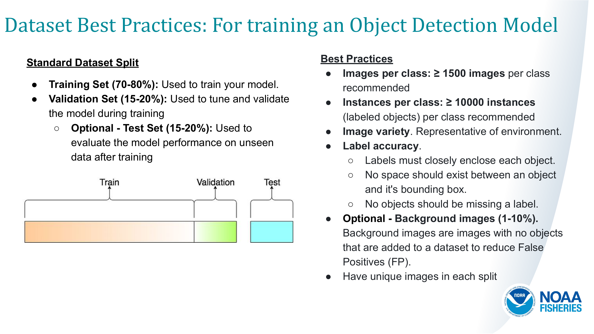

# Exercise - Dataset Prep

## Dataset Basics:
- Images per class. | ≥ 1500 images per class recommended
- Instances per class. |  ≥ 10000 instances (labeled objects) per class recommended
- Image variety. 
    - Must be representative of the environment. 
    - recommended: images from different regions, seasons, conditions, lighting, angles, different sources
- Label consistency. 
    - All instances of all classes in all images must be labelled. 
    - Partial labelling will impact performance.
- Label accuracy. 
    - Labels must closely enclose each object. No space should exist between an object, and it's bounding box. No objects should be missing a label.
- Background images. 
    - Background images are images with no objects that are added to a dataset to reduce False Positives (FP).  
    - 0-10% background images to help reduce FPs

## Split Dataset for Training

## Develop a Benchmark Test Dataset